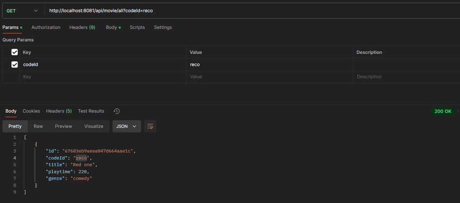

# apt-cinema

## Theme: Cinema
## Description
### For our theme for this Advanced Programming Topics project, we decided to go with a somewhat dying breath of entertainment, the cinema! We figured that there would be plenty of choices when it came to designing and thinking of microservices for a cinema, so that's why we decided to pick it! For this project, we mainly focused on the "movie part" of a cinema.

## Entities used
### - Movie
### - Auditorium
### - Visitor
### - Reservation

## Microservices
### - MovieService (Database: MongoDB)
### - AuditoriumService (Database: MySQL)
### - VisitorService (Database: MongoDB)
### - ReservationService (Database: MySQL)

## Other Components
### - Api Gateway
### - Main Workflow
### - Docker Compose

## Deployment Diagram
### 

## MovieService Endpoints
### Get
#### Getting all movies
#### Endpoint: /api/movie/all
#### 
#### Getting a specific movie by their code id
#### Endpoint: /api/movie
#### Query parameter: ?codeId=reco
#### 

### Post
#### Posting a movie
#### Endpoint: /api/movie
#### 
#### Getting all movies after the post
#### 

## AuditoriumService Endpoints
### Get
#### Getting all auditoriums
#### Endpoint: /api/auditorium/all
#### 
#### Getting a specific auditorium by their code id
#### Endpoint: /api/auditorium
#### Query parameter: ?codeId=51
#### 

### Post
### Posting an auditorium
#### Endpoint: /api/auditorium
#### 
#### Getting all auditoriums after post
#### 

### Put
#### Updating an already existing auditorium (codeId in body needs to belong to existing auditorium)
#### Endpoint: /api/auditorium
#### 

## VisitorService Endpoints
### Get
#### Getting all visitors
#### Endpoint: /api/visitor/all
#### 
#### Getting a specific visitor by their code id
#### Endpoint: /api/visitor
#### Query parameter: ?codeId=je04
#### 

### Post
#### Posting a visitor
#### Endpoint: /api/visitor
#### 
#### Getting all visitors after the post
#### 

## ReservationService Endpoints
### Get
#### Getting all reservations
#### Endpoint: /api/reservation
#### 

### Post
#### Posting a reservation
#### Endpoint: /api/reservation
#### 
#### Getting all reservations after the post
#### 

### Delete
#### Deleting a reservation
#### 

## Test Results
### Movie
### 

### Auditorium
### 

### Visitor
### 

### Reservation
### 

### Deployment
#### Github
#### 
#### Main Workflow
#### 
